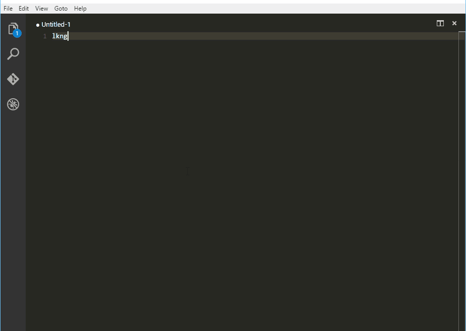

# Multiline Tricks
This plugins enables the line seletion and end line multi cursor behaviour of Sublime Text to VSCode.

## Line selection - Alt+L 
Selects the current cursor line.

## End line multi cursor - Alt+Shift+L
For each selected line, put a cursor an the end of it and unselect it.

